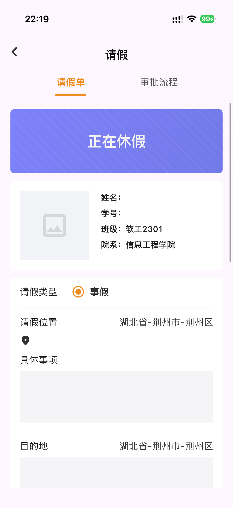
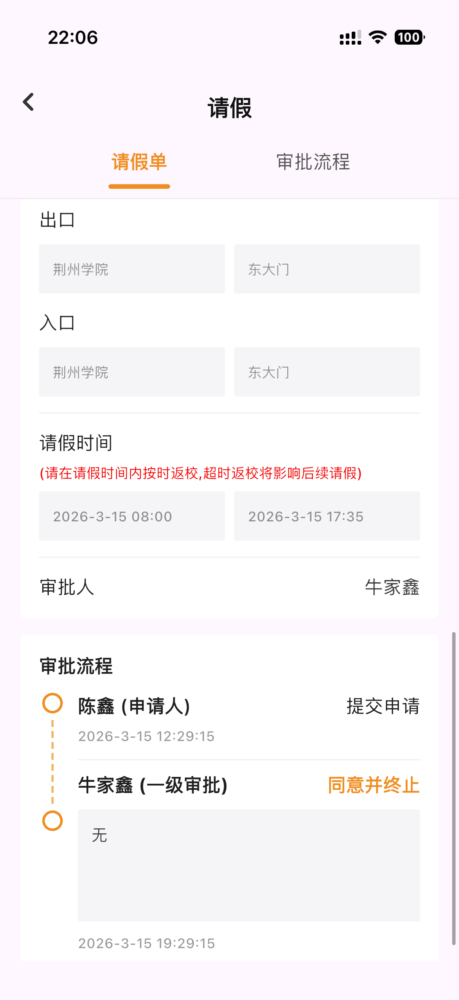
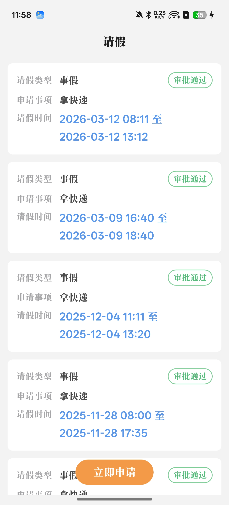

# 荆州学院请假程序

基于Flutter的虚拟请假程序

    <a href="README_EN.md">🌍 English</a>

## 项目简介
这是一个基于Flutter的纯界面项目，专门为荆州学院设计的请假程序，启用后会出现一个假的请假界面，用于欺骗门卫保安。

> 如果项目对您有帮助，请给个 Star 支持 ⭐ 这对我来说很重要，能给我带来长期更新维护的动力！

## 项目预览
<table>
    <tr>
        <td></td>
        <td></td>
        <td></td>
    <tr>
</table>